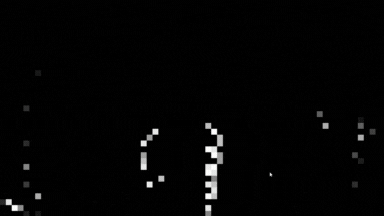

# 數位鏡面-遷

> 
> 寄蜉蝣於天地，渺滄海之一粟，哀吾生之須臾，羨長江之無窮。
>
> 挾飛仙以遨遊，抱眀月而長終。知不可乎驟得，託遺響於悲風。
>
> -前赤壁賦
> 

這是數位鏡面的第二個作品，起源於一個猜想：把兩張圖片互減是不是就可以看到他們的改變？

後來在學校中上了一門課叫做"數位設計"，最後的期末成果要策劃一個展覽，主題是"靠窗座位"。主題發想時不斷往下挖、尋找靠窗座位的本質，是窗外的景色嗎？是向前探索的期待嗎？我認為這個主題最重要的是"改變"。什麼是改變？兩個東西不一樣的地方就是改變。人是只看的到改變的，因為不變的東西太多太多了，許多痛苦的根源便像<前赤壁賦>中，只看見了改變、只看見失去，所以感覺什麼都沒留下。但是怎麼把這個表達出來？我想起了之前的猜想，將兩張照片互減，是不是就是改變？

## 實現方式

首先先來做做看兩張圖片互減會長怎樣吧，使用OpenCV來獲取影像，然後互減，再將結果用Pygame顯示出來，就這樣，第一版( [V0.0](/Code_version/V0.0.py) )做出來了。但做出來後，發現結果有點差強人意，他有點...不太直觀？看照片吧：


他的視覺效果不是那麼的...好看？所以基於這個圖片，做了一些後來的處理後變成第二版( [V1.0](/Code_version/V1.0.py) )這樣：



第二版做的最大改變是加入了疊圖，我將前幾幀的畫面疊進來，並做淡化處理，讓整個變化呈現的更明顯。不過做出來後好像還差了點靠窗座位的感覺，所以又把他的淡化改成慢慢縮小的方塊，有點車子開遠的感覺，最終成品如下：


補充：顯示之所以用Pygame

## 使用方式

### 1.直接使用安裝包

到連結中下載打包好的.exe檔：[https://drive.google.com/file/d/1HUE9LsAZ99WnqsUZsaMwt_MIobXOjask/view?usp=drive_link](https://drive.google.com/file/d/1HUE9LsAZ99WnqsUZsaMwt_MIobXOjask/view?usp=drive_link)

下載下來後請 **確定電腦有接到任何一顆鏡頭**，然後開啟這個程式，順利的話就會看到畫面了。

### 2.使用原碼執行

在開始之前先確定你有安裝 Python3，如果沒有的話請先去 [Python官網](https://www.python.org/) 安裝。

確定有安裝 Python3 後，將"main.py"與"requirements.txt"下載下來，並在電腦上執行：
```
pip install -r requirements.txt
```
等待其下載完後**確定電腦有接到任何一顆鏡頭**，確定接到後執行：
```
python3 main.py
```
順利的話就會看到畫面了。
